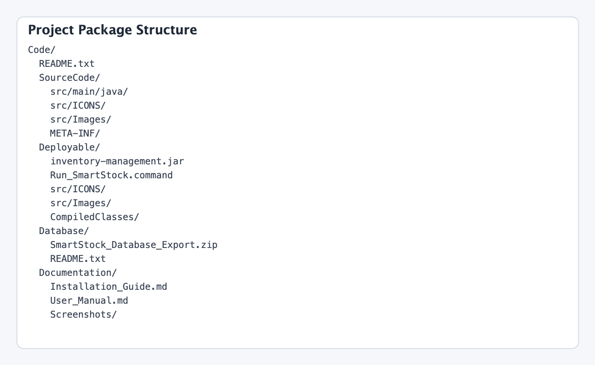
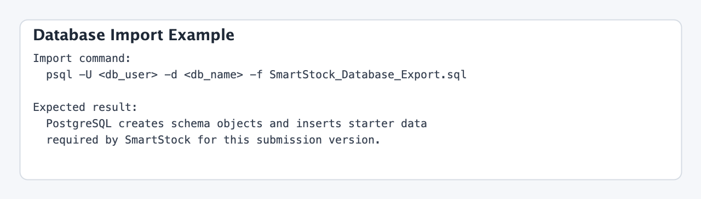
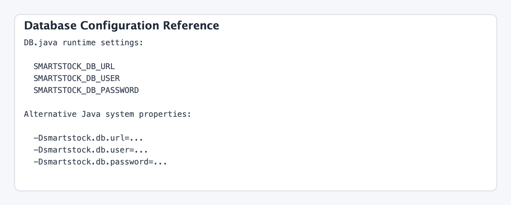
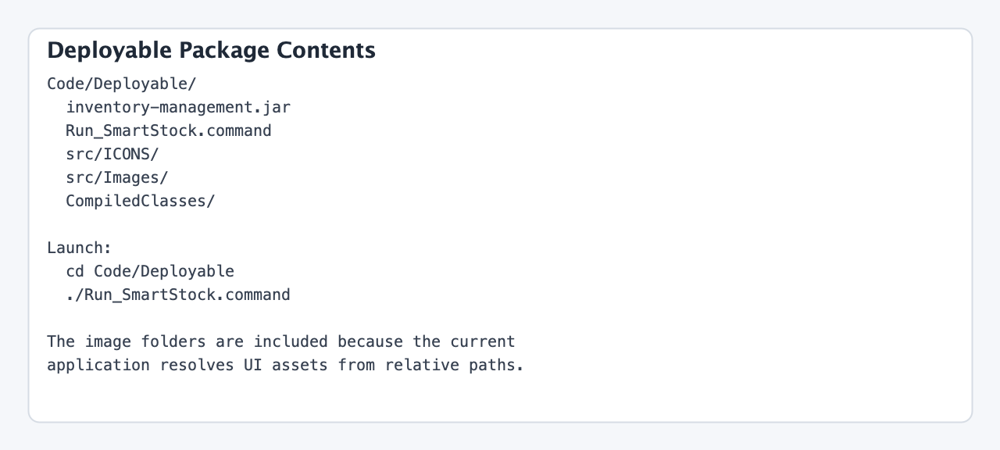

# SmartStock Installation Guide

## 1. Overview

This guide explains how to install and run the SmartStock desktop inventory system contained in this project package.

SmartStock is a Java Swing desktop application backed by a PostgreSQL database. The packaged application is delivered as an executable JAR in the `Code/Deployable` directory, while the source code and database deliverables are stored separately for traceability.

## 2. Prerequisites

Before installation, make sure the target machine has:

- Java Runtime Environment or JDK 23 or later
- PostgreSQL access for the target environment
- Terminal access to set environment variables before launching the application

## 3. Package Layout

Review the delivered package structure first.



## 4. Prepare the Database

Open the `Code/Database` folder and use `SmartStock_Database_Export.sql`.

Import the SQL into PostgreSQL:

```bash
psql -U <db_user> -d <db_name> -f SmartStock_Database_Export.sql
```

The SQL file recreates the database objects and inserts starter data required by the current version of SmartStock.



## 5. Configure the Application Connection

The application no longer stores hard-coded credentials in source code. Supply database settings through environment variables or Java system properties.

Supported environment variables:

- `SMARTSTOCK_DB_URL`
- `SMARTSTOCK_DB_USER`
- `SMARTSTOCK_DB_PASSWORD`

Example:

```bash
export SMARTSTOCK_DB_URL="jdbc:postgresql://localhost:5432/smartstock"
export SMARTSTOCK_DB_USER="smartstock_user"
export SMARTSTOCK_DB_PASSWORD="replace_with_real_password"
```

If you are reviewing the source package, the connection-loading logic is located in `Code/SourceCode/src/main/java/DB.java`.



## 6. Run the Deployable Build

The quickest way to launch the application is from the packaged JAR:

```bash
cd Code/Deployable
chmod +x Run_SmartStock.command
./Run_SmartStock.command
```

Alternative direct launch:

```bash
cd Code/Deployable
java -jar inventory-management.jar
```

The deployable package also includes the runtime image assets in `Deployable/src/ICONS` and `Deployable/src/Images`, because the current application loads these files using relative paths.



## 7. Run From Source in IntelliJ IDEA

If you need to inspect or modify the project:

1. Open `Code/SourceCode/Inventory Managment.iml` or the project folder in IntelliJ IDEA.
2. Confirm the project SDK is Java 23 or later.
3. Ensure the PostgreSQL JDBC driver is available. The packaged JAR already contains the driver, and the original IntelliJ artifact definition references PostgreSQL JDBC 42.7.3.
4. Set the same database environment variables in the Run Configuration.
5. Run the `Main` class.

## 8. First Launch Checklist

After launch:

1. The Welcome screen appears.
2. Select `Test Database Connection`.
3. Confirm the status changes to connected.
4. Select `Continue`.
5. Log in with the default SmartStock account loaded from the database.

Default login for grading:

- Username: `admin`
- Password: `Admin123!`

## 9. Environment-Specific Changes

The following items may need to be adjusted for each environment:

- PostgreSQL hostname, port, database name, username, and password
- Any firewall or network rules required to reach the database
- User accounts and store assignments inside the database
- Java installation path if the launcher is used on another workstation

## 10. Troubleshooting

### Missing database configuration

If the application reports missing configuration, verify that all three environment variables are present in the same terminal session used to launch the application.

### Database connection fails

Confirm:

- the PostgreSQL server is reachable
- the credentials are valid
- the database schema was imported successfully
- SSL parameters are included in the JDBC URL if your environment requires them

### Images do not appear

Launch the application from inside `Code/Deployable` so the JAR can resolve the bundled `src/ICONS` and `src/Images` folders using the expected relative paths.
